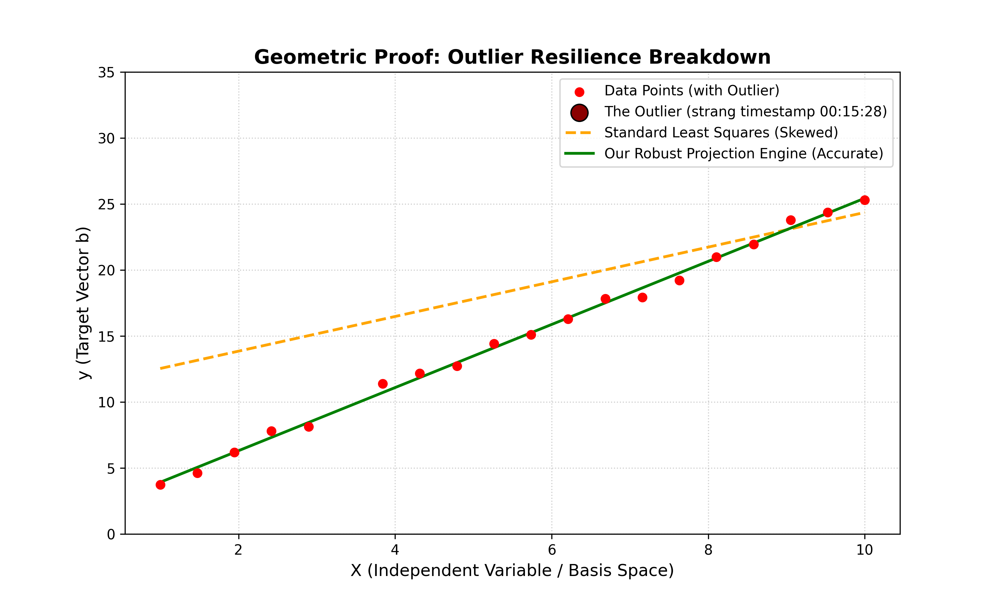

# Vector Space Regression Engine

An object-oriented linear regression engine built cleanly from scratch using pure NumPy. This project translates the fundamental vector-space proofs taught in **Gilbert Strang’s MIT 18.06 Lecture 16** into unit-testable software components, featuring a runtime geometric diagnostic suite and a robust RANSAC outlier estimator.



## 📐 Mathematical Foundations

Instead of utilizing gradient descent or black-box optimization frameworks, this engine directly constructs the underlying algebraic structures to project a target vector $b$ onto the column space $C(A)$ of our design matrix.

The architecture strictly satisfies and verifies the following linear algebra identities:

1. **The Normal Equations**: 
   $$\hat{x} = (A^T A)^{-1} A^T b$$
2. **The Hat (Projection) Matrix**: 
   $$P = A(A^T A)^{-1} A^T \quad \text{where} \quad p = Pb$$
3. **Orthogonality of Errors**: The error vector $e = b - p$ exists entirely within the left nullspace $N(A^T)$, meaning it is perpendicular to the column space:
   $$A^T e = 0$$
4. **Idempotency**: Projecting an already projected vector onto the same subspace yields no change:
   $$P^2 = P$$

---

## 🚀 Key Features

* **Pure Core Engine**: Direct vector-space projection that dynamically checks for multi-collinearity using matrix rank evaluations to ensure $A^T A$ is strictly invertible.
* **Geometric Diagnostics**: Automated runtime validation checking the mathematical integrity of the generated vector spaces ($P^2 = P$ and $\max(A^T e) < 10^{-10}$).
* **Robust Outlier Mitigation**: Implements a geometric Random Sample Consensus (RANSAC) meta-estimator engineered specifically to address the traditional least-squares vulnerability to extreme data anomalies (Strang Lecture 16, timestamp `00:15:28`).
* **Production-Grade Rigor**: Fully type-hinted code architecture accompanied by automated mathematical unit tests via `pytest`.

---

## 📦 Project Directory Structure

```text
linalg_regressor/
│
├── linalg_regressor/          # Core package directory
│   ├── __init__.py            # Package exposition
│   ├── engine.py              # Pure ProjectionRegressor
│   ├── diagnostics.py         # Geometric Diagnostics Suite
│   └── robust.py              # RobustProjectionRegressor (RANSAC)
│
├── tests/
│   └── test_engine.py         # Automated mathematical unit tests
│
├── walkthrough.py             # Strang's blackboard example verification
├── plot_projections.py        # Matplotlib visualization generator
└── requirements.txt           # Package dependencies

## 🛠️ Installation & Verification

1. Clone this repository:
   ```bash
   git clone [https://github.com/Komal-phogat/linalg-regressor.git](https://github.com/Komal-phogat/linalg-regressor.git)
   cd linalg-regressor

## 🚀 Quick Start Commands

Run these commands in your terminal to set up the environment, run the mathematical proofs, and verify the test coverage:

```bash
# 1. Install dependencies
pip install -r requirements.txt

# 2. Run Professor Strang's blackboard verification
python walkthrough.py

# 3. Execute the automated geometric test suite
python -m pytest tests/

# 4. Generate the outlier visualization plot
python plot_projections.py

